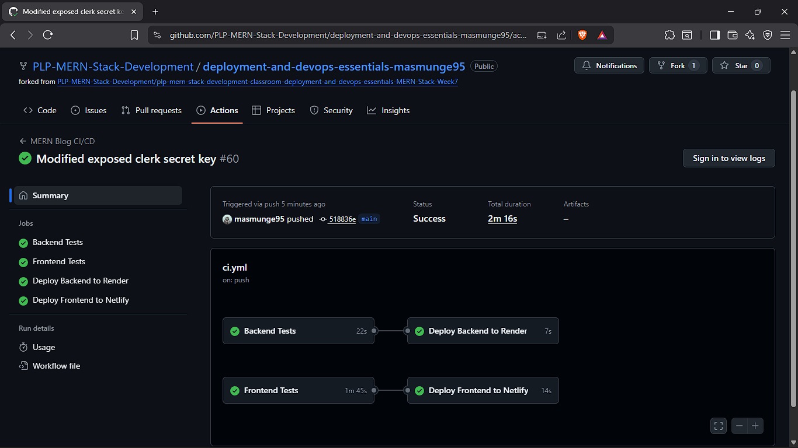
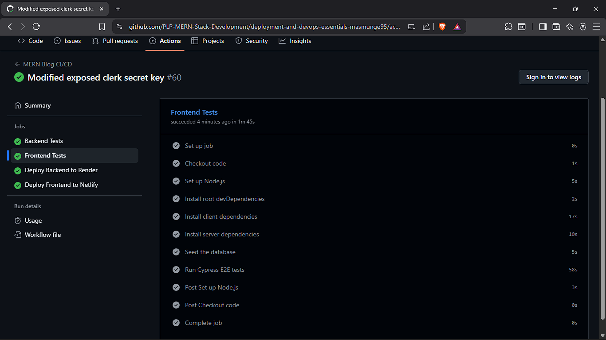

# MERN Blog Manager 🚀📝

A full-stack MERN application for creating, managing, and sharing blog content. It features an interactive dashboard for content management and a clean, public-facing view for individual posts. Built with secure Clerk authentication, a RESTful API backend, and a responsive React frontend styled with Tailwind CSS.

This version also includes a complete testing setup, allowing developers to clone the project and run unit, integration, and end-to-end tests to explore and verify the app’s reliability.  

💡 **Tip:** If you notice areas where test coverage could be improved, feel free to contribute! Expanding and refining the test suite strengthens the project’s overall quality and maintainability.

---

## Deployment 🌐

- **Frontend (Netlify):** [https://mern-blog-manager-v3.netlify.app/](https://mern-blog-manager-v3.netlify.app/)  
- **Backend (Render):** [https://deployment-and-devops-essentials-lyfy.onrender.com/](https://deployment-and-devops-essentials-lyfy.onrender.com/)

---

## Features ✨

- **Full CRUD for Posts & Categories** 📝: Create, read, update, and delete posts and categories through a sleek admin dashboard.  
- **Role-Based Authentication** 🔐: Secure user management with [Clerk](https://clerk.com/), featuring distinct roles for 'Editors' (content creators) and 'Viewers' (readers/commenters).  
- **Content Ownership** 🏷️: Editors have full control over their own posts and categories, cloned from system templates for content isolation.  
- **Featured Image Uploads** 🖼️: Upload and manage featured images using `multer`.  
- **Unique View Count** 👀: Posts track unique views from 'Viewers' over 24 hours.  
- **Comments System** 💬: Logged-in users can comment, edit, and delete their own comments.  
- **Server-Side Validation** ✅: Ensures data integrity with `express-validator`.  
- **Dark/Light Mode** 🌗: Switch themes with React Context.  
- **Pagination** 📄: Smooth navigation for large datasets.  
- **Searching and Filtering** 🔍: Filter public posts by category and search by tags.  

---

## Tech Stack 🛠️

- **Frontend:** React, Vite, Tailwind CSS, React Router  
- **Backend:** Node.js, Express.js  
- **Database:** MongoDB with Mongoose  
- **Authentication:** Clerk  
- **API Communication:** Axios  
- **File Uploads:** Multer  

---

## Screenshots 🖼️

### Testing Strategy 🧪

Multi-layered testing ensures reliability, maintainability, and confidence in the codebase.

#### 1. Unit Testing
- **Objective:** Verify individual functions, components, and hooks.  
- **Tools:** Jest, React Testing Library  
- **Client-Side:** Tests React components and custom hooks.  
- **Server-Side:** Tests utility and middleware functions using mocks.

#### 2. Integration Testing
- **Objective:** Test multiple parts working together.  
- **Tools:** Supertest, React Testing Library  
- **Client-Side:** Mock API services to test loading, success, and error states.  
- **Server-Side:** Use in-memory MongoDB to test API endpoints and database operations.

#### 3. End-to-End (E2E) Testing
- **Objective:** Simulate real user workflows.  
- **Tools:** Cypress  
- **Coverage:** Login flows, CRUD operations for posts, categories, and comments.  

#### 4. Visual Regression Testing
- **Objective:** Catch unintended UI changes.  
- **Tools:** `cypress-image-snapshot` plugin  
- **Process:** Compare baseline snapshots pixel-by-pixel to detect visual regressions.

---

### Test Coverage 📊

| Client Coverage Report | Server Coverage Report |
|:----------------------:|:----------------------:|
|  |  |

---

### CI/CD Pipeline ⚙️

GitHub Actions automates testing and deployment. On every push to `main` or `develop`, CI runs all tests. On successful push to `main`, CD deploys backend to Render and frontend to Netlify.

| CI/CD Workflow Overview | Detailed Job View |
|:-----------------------:|:-----------------:|
|  |  |

---

| Public Homepage View | Editor Dashboard View |
|:--------------------:|:---------------------:|
|  |  |

| Reader View (Latest Posts) | Mobile Responsive View |
|:--------------------------:|:----------------------:|
|  |  |

---

## Project Structure 📂

```
mern-blog-manager/
├── client/                      # React front-end
│   ├── public/                  # Static files
│   ├── cypress/                 # E2E and Visual Regression tests
│   ├── src/                     # React source code
│   │   ├── assets/              # Logo file directory
│   │   ├── components/          # Reusable components
│   │   ├── context/             # React context providers
│   │   ├── hooks/               # Custom React hooks
│   │   ├── pages/               # Page components
│   │   ├── services/            # API services
│   │   ├── tests/               # Jest tests (Unit & Integration)
│   │   ├── utils/               # Frontend utility functions
│   │   └── App.jsx              # Main application component
│   ├── package.json             # Client dependencies
│   └── vite.config.js           # Vite configuration

├── server/                      # Express.js back-end
│   ├── __mocks__/               # Manual mocks for external libraries
│   ├── src/                     # Server source code
│   │   ├── config/              # Configuration files
│   │   ├── controllers/         # Route controllers
│   │   ├── middleware/          # Custom middleware
│   │   ├── models/              # Mongoose models
│   │   ├── routes/              # API routes
│   │   └── utils/               # Backend utility functions
│   ├── tests/                   # Jest tests (Unit & Integration)
│   ├── uploads/                 # File uploads directory
│   ├── server.js                # Main server file
│   └── package.json             # Server dependencies
├── docs/                        # Documentation & reporting
│   └── coverage/                # Test coverage report screenshots
|
├── jest.config.js               # Root Jest configuration for monorepo
└── README.md                    # Project documentation

```


---

## Getting Started & Setup ⚡

### Prerequisites
- Node.js (v18+)  
- MongoDB (local or Atlas)  
- Clerk account for auth keys  
- [ngrok](https://ngrok.com/download) for local webhooks  

### 1. Clone the Repository
```bash
git clone [https://github.com/PLP-MERN-Stack-Development/testing-and-debugging-ensuring-mern-app-reliability-masmunge95.git](https://github.com/PLP-MERN-Stack-Development/testing-and-debugging-ensuring-mern-app-reliability-masmunge95.git)
cd <'mern-blog-manager-directory'>
```

## 2. Backend Setup 🛠️

```bash
cd server
npm install
```

Create `.env`:

```ini
NODE_ENV=development
PORT=5000
MONGO_URI="your_mongodb_connection_string"
CLERK_SECRET_KEY="your_clerk_secret_key_starting_with_sk_..."
CLERK_WEBHOOK_SECRET_LOCAL="your_local_webhook_secret_whsec_..."
CLERK_WEBHOOK_SECRET_PUBLISHED="your_production_webhook_secret_whsec_..."
```

---

## 3. Frontend Setup 🖥️

```bash
cd client
npm install
```

Create `.env`:

```ini
VITE_API_URL="your_production_backend_url"
VITE_CLERK_PUBLISHABLE_KEY="your_clerk_publishable_key_starting_with_pk_..."
```

Create `cypress.env.json`:

```json
{
  "CLERK_TEST_USER_EMAIL": "your_editor_test_user_email",
  "CLERK_TEST_USER_PASSWORD": "your_test_user_password",
  "CLERK_TEST_VIEWER_EMAIL": "your_viewer_test_user_email",
  "CLERK_TEST_VIEWER_PASSWORD": "your_test_user_password"
}
```

---

## 4. Clerk Configuration 🔑

Add API keys, JWT template, and webhooks for local and production as described above.

---

## 5. Run the Application ▶️

**Backend:**
```bash
cd server
npm start
```

**Frontend:**
```bash
cd client
npm run dev
```

Visit [http://localhost:5173](http://localhost:5173).

---

## 6. Deploy to Netlify 🌐

Fork repo, create Netlify site, connect GitHub, configure build and environment variables, then deploy.

---

## 7. Deploy to Render (Backend) 🖥️

Create web service, connect repo, set environment variables, deploy, and update URLs.

---

## 8. Running Tests 🧪

**Server:**
```bash
npm test
npm run test:unit
npm run test:integration
npm run test:coverage
```

**Client:**
```bash
npm test
npm run test:unit
npm run test:integration
npm run test:coverage
npm run cypress:open
npm run cypress:run
```

---

## 9. GitHub Actions Setup (CI/CD) ⚙️

**Repository Secrets:**  
`MONGO_URI`, `ALLOWED_ORIGINS`, `CLERK_SECRET_KEY`, `VITE_CLERK_PUBLISHABLE_KEY`, Cypress test user credentials.

**Environment Secrets (Production):**  
`RENDER_DEPLOY_HOOK_URL`, `NETLIFY_AUTH_TOKEN`

**Repository Variables:**  
`NETLIFY_SITE_ID`

---

## Debugging & Reliability 🛡️

**Server:** Global error handler, request logging, performance monitoring  
**Client:** Error boundaries, memoization  
**Monitoring:** Sentry integration with session replay

---

## API Documentation 📄

| Method | Endpoint | Description | Access |
|--------|---------|-------------|--------|
| GET    | /api/posts | Get posts (public/editor) | Public/Editor |
| POST   | /api/posts | Create a new post | Editor |
| GET    | /api/posts/:id | Get single post | Public |
| GET    | /api/posts/authenticated/:id | Get post for logged-in users | Viewer/Editor |
| PUT    | /api/posts/:id | Update post | Owner |
| PATCH  | /api/posts/:id/status | Update post status | Owner |
| DELETE | /api/posts/:id | Delete post | Owner |
| POST   | /api/posts/:id/comments | Add comment | Viewer/Editor |
| PUT    | /api/posts/:id/comments/:cid | Update comment | Owner |
| DELETE | /api/posts/:id/comments/:cid | Delete comment | Owner |
| GET    | /api/categories | Get categories | Public/Editor |
| POST   | /api/categories | Create category | Editor |
| PUT    | /api/categories/:id | Update category | Owner |
| DELETE | /api/categories/:id | Delete category | Owner |

---

## Troubleshooting 🛠️

- **Peer dependency errors** → `npm install --legacy-peer-deps`  
- **Module not found** → install missing packages  
- **Import path issues** → use `@` alias  
- **API 404** → proxy `/api` to backend  
- **500 on Render** → check `CLERK_SECRET_KEY`  

---

**Happy coding and blogging! 🚀💻**
